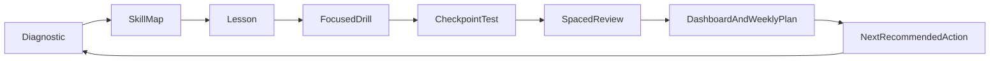

# Closed-Loop TOEIC Learning Upgrade Plan

## Goal
Build a real learning loop on top of the current trainer so the product is no longer just `question bank -> training -> history -> report`, but a guided program with:

- `Diagnostic`
- `Lesson`
- `Focused drill`
- `Checkpoint test`
- `Spaced review`
- `Weekly next-step planning`

The first production scope should stay on **Reading / Grammar / Vocabulary**, but the architecture should leave a clean path for **Listening** later.

## Current Baseline
The current app already has a strong **assessment / review engine**:

- Main runtime source of truth is [`prisma/schema.prisma`](prisma/schema.prisma) using `QuestionBankItem`, `StudySession`, `StudySessionQuestion`, `AnswerHistory`, `FsrsCardState`, `ReviewLog`, and `EloState`.
- Training flow is implemented in [`src/lib/training.ts`](src/lib/training.ts) and currently uses one generic question picker:

```ts
export async function pickTrainingQuestionIds(limit = TRAINING_QUESTION_LIMIT) {
  return composeSession(limit);
}
```

- Session composition already mixes **due review + reinforcement + new items** in [`src/lib/session-composer.ts`](src/lib/session-composer.ts).
- Wrong-answer explanation, weekly coaching, and Part 5 generation / verification already exist under [`src/lib/llm/`](src/lib/llm/) and [`src/app/api/llm/`](src/app/api/llm/).
- Question classification already exists in a schema-safe way through [`src/lib/question-taxonomy.ts`](src/lib/question-taxonomy.ts) and the seeded bank in [`prisma/seed-data/personalized-phase1-bank.ts`](prisma/seed-data/personalized-phase1-bank.ts).

This means the product already has the **review and analytics core**, but it does **not** yet have an explicit **pedagogical layer**.

## Product Design Direction
Use a **hybrid closed loop**:



### User-facing stages
1. **Diagnostic**
   - Short baseline session by category / topic / sub-focus.
   - Output: weak skills, current phase placement, recommended module.

2. **Lesson**
   - Short, structured teaching unit for one skill.
   - Includes concept explanation, bilingual examples, common traps, and mini self-check.

3. **Focused drill**
   - 5 to 10 targeted items for the same skill.
   - Hint-first interaction is allowed before full reveal.

4. **Checkpoint test**
   - Mixed items inside the module.
   - Pass threshold determines whether learner advances or returns to remediation.

5. **Spaced review**
   - Existing FSRS-driven review remains the long-term memory engine.

6. **Weekly plan / next action**
   - Convert recent results into a concrete recommendation: review, lesson, drill, or checkpoint.

## Architecture Recommendation
### Keep
Keep the current runtime engine as the base layer:

- [`prisma/schema.prisma`](prisma/schema.prisma)
- [`src/lib/training.ts`](src/lib/training.ts)
- [`src/lib/session-composer.ts`](src/lib/session-composer.ts)
- [`src/lib/fsrs.ts`](src/lib/fsrs.ts)
- [`src/lib/elo.ts`](src/lib/elo.ts)
- [`src/lib/history.ts`](src/lib/history.ts)
- [`src/lib/report.ts`](src/lib/report.ts)

### Do not build the new system on the legacy models
Do **not** try to revive the older `LearningItem`, `QuestionItem`, `DailySession`, or `ReviewQueue` path from [`prisma/schema.prisma`](prisma/schema.prisma). That would split the product into two learning systems.

### Add a new curriculum layer above the current engine
Use a **content-in-files, progress-in-DB** approach.

#### File-based curriculum definitions
Create versioned program definitions in a new content area, for example:

- [`src/content/programs/phase1/`](src/content/programs/phase1/)
- [`src/content/programs/phase1/modules.ts`](src/content/programs/phase1/modules.ts)
- [`src/content/programs/phase1/lessons/`](src/content/programs/phase1/lessons/)

Each module definition should contain:

- `moduleKey`
- `phaseKey`
- `titleZh`, `titleEn`
- `targetSkills` (category, topic, sub-focus)
- `entryCriteria`
- `checkpointRules`
- `recommendedDrillCount`
- `listeningReady` flag for future expansion

This keeps curriculum authoring easy, reviewable, and git-friendly.

#### DB progress layer
Add only the minimum new persistence needed for closed-loop progression:

- `ProgramEnrollment` or `LearnerProgramState`
- `ModuleProgress`
- `StudyTask`
- `CheckpointAttempt`
- optional `SkillState` if derived analytics become too expensive to compute on demand

### Session modes
Extend the current training flow so it can start sessions with explicit intent rather than one generic `quick` mode.

Recommended session modes:

- `diagnostic`
- `lesson_drill`
- `checkpoint`
- `review`
- `mixed_practice`

Core change: replace the single generic question picker in [`src/lib/training.ts`](src/lib/training.ts) with a mode-aware session planner that can call different selection strategies.

## Data / Classification Strategy
### Short-term
Use current metadata as the first closed-loop skill map:

- `topic`
- `difficulty`
- taxonomy stored in `notes` via [`src/lib/question-taxonomy.ts`](src/lib/question-taxonomy.ts)
- `priorKnown`

This is enough to launch Reading / Grammar / Vocabulary modules without a major re-tagging effort.

### Medium-term
Move from string parsing to explicit skill keys.

Recommended direction:

- introduce a stable `skillKey` or `QuestionSkillMap`
- keep `notes` for human-readable display only
- migrate manual create/edit/import so taxonomy is not lost

Important issue to address early:
manual question create/edit currently does not reliably maintain taxonomy metadata, while CSV import can write `notes` differently from `formatQuestionNotes`. This will weaken any module routing unless normalized.

## User Experience Plan
### New page structure
Add a guided learning entrypoint instead of using `/training` as the only study action.

Recommended routes:

- [`src/app/learn/page.tsx`](src/app/learn/page.tsx) — learner home / next action
- [`src/app/learn/module/[moduleKey]/page.tsx`](src/app/learn/module/[moduleKey]/page.tsx) — lesson overview
- [`src/app/learn/module/[moduleKey]/lesson/page.tsx`](src/app/learn/module/[moduleKey]/lesson/page.tsx)
- [`src/app/learn/module/[moduleKey]/drill/page.tsx`](src/app/learn/module/[moduleKey]/drill/page.tsx)
- [`src/app/learn/module/[moduleKey]/checkpoint/page.tsx`](src/app/learn/module/[moduleKey]/checkpoint/page.tsx)
- keep [`src/app/training/page.tsx`](src/app/training/page.tsx) as the lower-level session UI engine, but make it driven by the selected mode and plan

### Dashboard changes
Refactor the dashboard from metrics-only to **action-oriented**:

- “Your current module”
- “Next best action”
- “Skills at risk”
- “Checkpoint readiness”
- “Review due today”

Relevant files:

- [`src/app/page.tsx`](src/app/page.tsx)
- [`src/lib/dashboard.ts`](src/lib/dashboard.ts)
- existing dashboard widgets in [`src/components/dashboard/`](src/components/dashboard/)

## LLM / Prompt Design
Treat LLM as a **teaching assist layer**, not the source of truth for scoring or progression.

### Principles
- Deterministic scoring and progression come from DB data, taxonomy, FSRS, and explicit thresholds.
- LLM is used for explanation, lesson drafting, hinting, and study-plan narration.
- Every prompt should have a strict role, explicit output format, and version string.
- Extend [`src/lib/llm/types.ts`](src/lib/llm/types.ts) and `LlmUsageLog` usage so lesson / diagnostic / plan tasks are visible.

### Prompt inventory to add
#### 1. `diagnostic-skill-analyzer-v1`
Input:
- recent `AnswerHistory`
- topic / category / sub-focus aggregates
- target phase and current module

Output JSON:
- `weakSkills[]`
- `emergingSkills[]`
- `recommendedModuleKey`
- `confidence`
- `reasoningSummaryZh`

Use case:
- post-diagnostic placement
- post-checkpoint remediation decision

#### 2. `micro-lesson-writer-v1`
Input:
- `skillKey`
- target level
- common learner errors
- 2 to 4 representative questions

Output JSON:
- `lessonTitleZh`
- `coreRuleZh`
- `whyThisMattersZh`
- `workedExamples[]`
- `commonTraps[]`
- `miniCheck[]`
- `reviewSummaryZh`

Use case:
- create lesson pages for weak skills
- optionally pre-generate and cache curated lessons

#### 3. `guided-hint-v1`
Input:
- current question
- learner wrong choice or hesitation state
- target hint depth

Output JSON:
- `hintLevel1`
- `hintLevel2`
- `hintLevel3`
- `doNotRevealAnswerYet`

Use case:
- make drill mode instructional rather than test-only

#### 4. `checkpoint-feedback-coach-v1`
Input:
- checkpoint results by skill
- pass / fail threshold
- mistakes with snapshots

Output JSON:
- `resultLabel`
- `skillsToReview[]`
- `retryPlan[]`
- `advanceAllowed`
- `coachMessageZh`

Use case:
- end-of-module feedback and unlock logic

#### 5. `weekly-study-plan-v2`
Extend the current weekly coaching prompt in [`src/lib/llm/weekly-report.ts`](src/lib/llm/weekly-report.ts) so it outputs:

- next module recommendation
- review block
- drill block
- checkpoint readiness
- one concrete weekly target

### Prompt placement
Keep prompt templates centralized, for example:

- [`src/lib/llm/prompt-templates.ts`](src/lib/llm/prompt-templates.ts)
- [`src/lib/llm/lesson.ts`](src/lib/llm/lesson.ts)
- [`src/lib/llm/diagnostic.ts`](src/lib/llm/diagnostic.ts)
- [`src/lib/llm/hints.ts`](src/lib/llm/hints.ts)

## Execution Phases
### Phase 1 — Curriculum foundation
- define canonical skill map from current bank
- normalize taxonomy across manual create/edit/import/seed
- create file-based program/module definitions
- add progress models and study task orchestration

### Phase 2 — Guided learning flow
- build `/learn` entrypoint
- implement lesson pages and module overview
- add session modes for diagnostic, drill, checkpoint
- keep current training UI as the rendering engine where possible

### Phase 3 — AI teaching assist
- add lesson / hint / diagnostic / checkpoint prompts
- extend `LlmUsageLog` task types and prompt version tracking
- add safe fallbacks when no API key is present

### Phase 4 — Dashboard / report closure
- surface current module, readiness, at-risk skills, and next action
- extend weekly report into study-planning output
- connect history and report back into module progression

### Phase 5 — Listening roadmap
Do not implement first, but preserve for later:

- map future modules to `ListeningSetLegacy` / `ListeningSetV2`
- add audio-aware lesson/checkpoint flow
- keep program layer content-model-neutral so listening can plug into it

## Validation Strategy
The first implementation should validate the closed loop with one full learner journey:

1. new learner enters `/learn`
2. completes diagnostic
3. gets assigned one module
4. reads lesson
5. completes drill
6. takes checkpoint
7. receives review schedule and weekly next action
8. dashboard and report reflect module state

Validation should cover:

- progression state correctness
- session mode routing
- question selection by skill
- fallback behavior without LLM keys
- no regression to existing `/training`, `/history`, `/report`, `/questions`, `/import`

## Recommended first implementation slice
Deliver a thin but real MVP, not the whole vision at once:

- one new `learn` homepage
- one phase with 3 to 5 modules
- one diagnostic mode
- one lesson template
- one drill mode
- one checkpoint mode
- one weekly next-action recommendation
- one new prompt set for lesson + hint + diagnostic feedback

This will prove the loop before expanding breadth.

## Key files to touch first
- [`prisma/schema.prisma`](prisma/schema.prisma)
- [`src/lib/training.ts`](src/lib/training.ts)
- [`src/lib/session-composer.ts`](src/lib/session-composer.ts)
- [`src/lib/question-taxonomy.ts`](src/lib/question-taxonomy.ts)
- [`src/lib/questions.ts`](src/lib/questions.ts)
- [`src/app/page.tsx`](src/app/page.tsx)
- [`src/app/training/page.tsx`](src/app/training/page.tsx)
- [`src/lib/llm/prompt-templates.ts`](src/lib/llm/prompt-templates.ts)
- [`src/lib/llm/types.ts`](src/lib/llm/types.ts)
- [`src/lib/llm/weekly-report.ts`](src/lib/llm/weekly-report.ts)
- [`prisma/seed-data/personalized-phase1-bank.ts`](prisma/seed-data/personalized-phase1-bank.ts)

## Deliverables for the next execution step
The next build step should produce three concrete artifacts:

- a **technical design document** for the new curriculum / progress / session-mode architecture
- a **delivery plan** broken into implementation phases and milestones
- a **prompt pack** with versioned prompt specs and JSON output contracts for diagnostic, lesson, hint, checkpoint, and weekly planning
