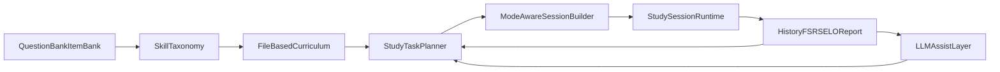
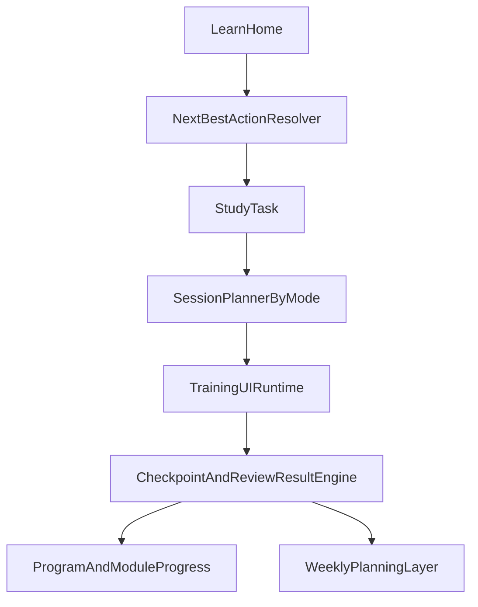

# Closed-Loop TOEIC Technical Design

## Goal

Upgrade the current TOEIC Trainer from a quiz-centric app into a **closed-loop learning system** for Phase 1:

- diagnostic
- lesson
- focused drill
- checkpoint
- spaced review
- weekly next-action planning

The first implementation scope stays on **Reading / Grammar / Vocabulary** and preserves a clean path for future Listening support.

## Design principles

### 1. Keep the current training engine as the base layer

The app already has a strong runtime core:

- `QuestionBankItem`
- `StudySession`
- `StudySessionQuestion`
- `AnswerHistory`
- `FsrsCardState`
- `ReviewLog`
- `EloState`

These should remain the storage and analytics engine behind the new learning loop.

### 2. Do not split the product into two learning systems

The legacy schema path (`LearningItem`, `QuestionItem`, `DailySession`, `ReviewQueue`) should **not** become the foundation of the new loop. Reusing it would create two competing learning models inside one app.

### 3. Keep curriculum content in files, learner progress in the database

Curriculum definitions should be easy to version in git. Learner state should be persisted in Prisma.

### 4. Use deterministic progression, not prompt-only progression

LLMs can explain, hint, summarize, and draft lessons. They should **not** be the source of truth for:

- whether a learner passed
- which question belongs to which module
- whether a learner unlocks the next stage

## Proposed architecture

## Layer-by-layer design

### Layer 1: Existing bank and runtime engine

Keep these as the execution substrate:

- `src/lib/training.ts`
- `src/lib/session-composer.ts`
- `src/lib/fsrs.ts`
- `src/lib/elo.ts`
- `src/lib/history.ts`
- `src/lib/report.ts`

### Layer 2: Skill taxonomy

Add one stable mapping layer between raw bank metadata and learning modules.

Current raw signals:

- `topic`
- `difficulty`
- taxonomy encoded in `notes`
- `priorKnown`

New canonical layer:

- `Phase1SkillKey`
- `Phase1TopicKey`
- `Phase1ModuleKey`

Implemented in:

- `src/content/programs/phase1/types.ts`
- `src/content/programs/phase1/skill-map.ts`
- `docs/closed-loop/phase1-skill-map.md`

### Layer 3: File-based curriculum definitions

Each module should be defined in source-controlled files and contain:

- title and summary
- target skills
- entry criteria
- lesson objectives
- lesson outline
- drill blueprint
- checkpoint blueprint
- pass threshold
- remediation link
- listening readiness flag

Implemented scaffolding:

- `src/content/programs/phase1/modules.ts`

### Layer 4: Learner progress state

This layer is not implemented yet in the runtime, but it is the recommended next schema step.

Minimal progress models:

- `LearnerProgramState`
  - `programKey`
  - `activeModuleKey`
  - `phaseStatus`
  - `lastRecommendedAction`

- `ModuleProgress`
  - `moduleKey`
  - `status`
  - `diagnosticAccuracy`
  - `checkpointAccuracy`
  - `lastStartedAt`
  - `lastCompletedAt`

- `StudyTask`
  - `taskType` (`diagnostic`, `lesson`, `lesson_drill`, `checkpoint`, `review`)
  - `moduleKey`
  - `skillKeys`
  - `status`
  - `scheduledFor`

- `CheckpointAttempt`
  - `moduleKey`
  - `accuracy`
  - `passThreshold`
  - `passed`
  - `summarySnapshot`

Optional only if analytics become expensive:

- `SkillState`
  - pre-aggregated accuracy by `skillKey`
  - attempt counts
  - rolling trend

## Session-mode architecture

The current system has one major public training path:

- start session
- answer question
- reveal
- rate
- next question

That flow should be retained, but **session planning** should become mode-aware.

### Recommended modes

- `diagnostic`
- `lesson_drill`
- `checkpoint`
- `review`
- `mixed_practice`

### Selection strategy by mode

#### `diagnostic`

Purpose:

- establish or refresh skill placement

Selection:

- broad but balanced skill coverage
- lower review weight than normal FSRS
- medium difficulty bias
- no repeated skill cluster dominance

#### `lesson_drill`

Purpose:

- practice one module after reading the lesson

Selection:

- target 1 to 3 module skills only
- allow hint surfaces
- mix new and reinforcement questions inside the same skill family

#### `checkpoint`

Purpose:

- determine advance or remediation

Selection:

- no hints
- fixed skill mix
- broader within-module coverage
- higher consistency than exploratory session composition

#### `review`

Purpose:

- preserve long-term memory

Selection:

- existing FSRS-first strategy
- optionally filtered to current module's weak skills

#### `mixed_practice`

Purpose:

- bridge focused learning and exam-like pressure

Selection:

- cross-module
- moderate due load
- controlled topic interleaving

## Runtime responsibility split

### Keep `src/app/training/page.tsx` as the execution shell

This page already knows how to render:

- active question
- reveal state
- explanation
- rating
- completed summary

That means the next implementation should avoid rebuilding the answer UI from zero. Instead:

- `/learn/...` pages decide **what kind of session** is being launched,
- `/training` or a shared session renderer executes that session.

## Learn UX architecture

### New route family

Recommended structure:

- `src/app/learn/page.tsx`
- `src/app/learn/module/[moduleKey]/page.tsx`
- `src/app/learn/module/[moduleKey]/lesson/page.tsx`
- `src/app/learn/module/[moduleKey]/drill/page.tsx`
- `src/app/learn/module/[moduleKey]/checkpoint/page.tsx`

### Learn home responsibilities

The new `learn` home should answer five learner questions:

1. What module am I on?
2. What should I do next?
3. What skill is weakest right now?
4. Am I ready for checkpoint?
5. How many reviews are due today?

### Dashboard evolution

The current dashboard should remain useful, but it should become more action-oriented:

- current module
- next best action
- at-risk skills
- checkpoint readiness
- due reviews today
- recent sessions and weekly plan

## Prompt architecture

Prompt logic should sit in `src/lib/llm/` beside the current explanation and weekly report code.

Added scaffolding:

- `src/lib/llm/closed-loop-prompts.ts`
- updated `src/lib/llm/types.ts`

The prompt pack covers:

- diagnostic analysis
- micro-lesson writing
- guided hints
- checkpoint coaching
- weekly study planning

## Data quality risks

The closed-loop design will fail if taxonomy quality is not stabilized first.

### Current risks

- manual question create/edit drops taxonomy
- JSON import cannot preserve taxonomy
- CSV import writes non-canonical `notes`
- session composition does not yet understand skill families

### Required mitigation

Before routing live study tasks through modules:

1. create one normalization helper for manual create/edit/import
2. enforce canonical skill metadata on new content
3. preserve current human-readable `notes`, but do not depend on free-form strings forever

## Recommended implementation order

### Step 1

- lock the Phase 1 skill map
- lock the curriculum/module file structure
- lock prompt contracts

### Step 2

- add progress state schema
- add `learn` entrypoint
- add session planner by mode

### Step 3

- add guided hints and lesson pages
- add checkpoint result engine
- connect weekly planning to module progression

## Non-goals for the first implementation

- full listening player
- multi-user product design
- LLM-only lesson generation without deterministic fallbacks
- rebuilding the current training UI from scratch
- migrating the product onto the legacy models

## Acceptance definition for the closed-loop MVP

The MVP is successful when one learner can:

1. enter `Learn`
2. complete a diagnostic
3. receive one recommended module
4. open a lesson
5. complete a targeted drill
6. take a checkpoint
7. receive either advancement or remediation
8. see due reviews and a weekly next action on the dashboard
