# Production ERD v2 — Closed-loop content + execution (draft)

**Status:** Blueprint for future Prisma migrations. **Does not modify `schema.prisma`.**

**Sources:** `docs/closed-loop/**`, `src/content/programs/phase1/**`, `prisma/schema.prisma`, `README.md`, `docs/upgrade-matrix.md`.

**Scope:** What the repo can actually land: file-based curriculum + existing bank/session/FSRS/ELO engine + new progress/orchestration tables. No idealized multi-tenant product unless explicitly marked post-MVP.

---

## 1. Mermaid ERD

> **Legend**
>
> - **Solid entities** in the diagram mix **already implemented Prisma models** (names match `schema.prisma`) with **proposed** models (marked *new* in §2).
> - **Content-layer** Program / Module / Skill / Topic / Lesson are **curriculum concepts**; in MVP they are **code-defined** (`PHASE1_PROGRAM`, `PHASE1_MODULES`, `PHASE1_SKILLS`, `PHASE1_TOPIC_LABELS`). The diagram shows their **logical relationships** so execution-layer FKs (`programKey`, `moduleKey`, `skillKey`, `topicKey`) have a defined meaning.
> - **LearningSession** = current runtime model **`StudySession`** (table `study_sessions`). **LearningSessionItem** = **`StudySessionQuestion`** (`study_session_question`). Names in the diagram follow this doc’s vocabulary; schema renames are a later migration decision.
> - **ReviewCard:** no separate table — **reuse `FsrsCardState` + `ReviewLog`** per question (see §3).

```mermaid
erDiagram
  %% ========= Content layer (canonical definitions live in git: types.ts, skill-map.ts, modules.ts) =========
  Program {
    string programKey PK "e.g. phase1"
    string titleZh
    string titleEn
  }

  Module {
    string moduleKey PK "e.g. phase1-document-workflow"
    string programKey FK
    string titleZh
    string titleEn
  }

  Skill {
    string skillKey PK "Phase1SkillKey"
    string titleZh
    string titleEn
  }

  Topic {
    string topicKey PK "Phase1TopicKey"
    string labelZhEn
  }

  Lesson {
    string moduleKey FK
    int lessonIndex "0-based index into lessonOutline + lessonObjectives"
    string titleZh
    string titleEn
  }

  LessonAsset {
    string id PK "optional future"
    string moduleKey FK
    int lessonIndex
    string assetKind "markdown | static_url | prompt_ref"
    string uriOrRef
  }

  Program ||--o{ Module : "modules[]"
  Module ||--o{ Lesson : "lessonOutline[]"
  Module }o--o{ Skill : "targetSkills[]"
  Skill }o--o{ Topic : "matcher.topicKeys[]"
  Lesson ||--o{ LessonAsset : "optional CMS"

  %% ========= Identity & enrollment =========
  User {
    int id PK
    string name
    datetime createdAt
  }

  UserProfile {
    string id PK "new"
    int userId FK "unique"
    string locale "optional"
    string prefsJson "optional"
  }

  Enrollment {
    string id PK "new"
    int userId FK
    string programKey FK "matches Program.programKey"
    datetime enrolledAt
    string status "active | paused"
  }

  ProgramProgress {
    string id PK "new — was LearnerProgramState in technical-design"
    int userId FK
    string programKey FK
    string activeModuleKey "nullable"
    string phaseStatus "optional"
    string lastRecommendedActionJson "optional"
    datetime updatedAt
  }

  ModuleProgress {
    string id PK "new"
    int userId FK
    string moduleKey FK
    string status "not_started | in_progress | completed"
    float diagnosticAccuracy "nullable"
    float checkpointAccuracy "nullable"
    datetime lastStartedAt
    datetime lastCompletedAt
  }

  UserTopicProgress {
    string id PK "new optional aggregate"
    int userId FK
    string topicKey FK
    int attempts
    int correct
    datetime updatedAt
  }

  StudyTask {
    string id PK "new"
    int userId FK
    string programKey FK
    string moduleKey FK "nullable"
    string taskType "diagnostic | lesson | lesson_drill | checkpoint | review | mixed_practice"
    string skillKeysJson "optional"
    string status "pending | in_progress | done | skipped"
    datetime scheduledFor "nullable"
    int studySessionId FK "nullable → LearningSession"
  }

  CheckpointAttempt {
    string id PK "new"
    int userId FK
    string moduleKey FK
    int studySessionId FK "nullable"
    float accuracy
    float passThreshold
    bool passed
    string summarySnapshotJson "optional"
    datetime createdAt
  }

  %% ========= Bank & scheduling (existing) =========
  QuestionBankItem {
    int id PK
    string questionText UK
    string topic
    string difficulty
    string notes "taxonomy / grammar hints"
  }

  FsrsCardState {
    string id PK
    int questionId FK "ReviewCard = this row"
    datetime due
    string state
  }

  ReviewLog {
    string id PK
    int questionId FK
    datetime review
  }

  EloState {
    string id PK
    string kind
    string subjectId
    float rating
  }

  %% ========= Session runtime (existing; diagram names = doc names) =========
  LearningSession {
    int id PK "Prisma: StudySession"
    datetime startedAt
    datetime endedAt
    datetime abandonedAt
    string mode
    int targetCount
  }

  LearningSessionItem {
    string id PK "Prisma: StudySessionQuestion"
    int sessionId FK
    int questionId FK
    int position
  }

  AnswerHistory {
    int id PK
    int sessionId FK
    int questionId FK
    bool isCorrect
    datetime answeredAt
  }

  LlmUsageLog {
    string id PK
    string taskType
    bool success
  }

  %% ========= Relationships: identity → progress → tasks =========
  User ||--o| UserProfile : "optional"
  User ||--o{ Enrollment : "MVP often 1 row"
  User ||--o{ ProgramProgress : "one row per programKey"
  User ||--o{ ModuleProgress : "per moduleKey"
  User ||--o{ UserTopicProgress : "optional rollup"
  User ||--o{ StudyTask : "orchestration queue"
  User ||--o{ CheckpointAttempt : "deterministic outcomes"

  Enrollment }o--|| Program : "programKey string ref"
  ProgramProgress }o--|| Program : "programKey string ref"
  ModuleProgress }o--|| Module : "moduleKey string ref"
  StudyTask }o--|| Module : "optional moduleKey"
  CheckpointAttempt }o--|| Module : "moduleKey"

  %% ========= Tasks & sessions =========
  StudyTask }o--o| LearningSession : "spawns"
  LearningSession ||--o{ LearningSessionItem : "items"
  LearningSession ||--o{ AnswerHistory : "answers"
  CheckpointAttempt }o--o| LearningSession : "may reference checkpoint session"

  %% ========= Bank & FSRS =========
  QuestionBankItem ||--o{ LearningSessionItem : "picked"
  QuestionBankItem ||--o{ AnswerHistory : "snapshots"
  QuestionBankItem ||--o| FsrsCardState : "1:1 card"
  QuestionBankItem ||--o{ ReviewLog : "history"

  %% Skill ↔ QuestionBankItem: logical match via topic/notes normalization — no FK in MVP (see §2)

  %% ========= Interaction layer (not in repo; sketch only) =========
  DiscussionThread {
    string id PK "future"
    int userId FK
    string contextType "module | question"
    string contextId
  }

  DiscussionPost {
    string id PK "future"
    string threadId FK
    string body
    datetime createdAt
  }

  MediaRef {
    string id PK "future"
    string url
    string mime
  }

  DiscussionThread ||--o{ DiscussionPost : "posts"
  LessonAsset }o..o| MediaRef : "optional link"

  User ||--o{ DiscussionThread : "future"
```

---

## 2. Model dictionary

### 2.1 Content layer (curriculum)

| Model | Role | MVP? | Exists in repo? | Recommendation |
|-------|------|------|-----------------|----------------|
| **Program** | Phase-level container (`phase1`); titles and summary. | Yes (concept) | **Yes** — `PHASE1_PROGRAM` in `modules.ts` | **Keep code-defined** for MVP; DB row optional later for admin/CMS. |
| **Module** | Unit with entry criteria, lesson outline, drill/checkpoint blueprints, remediation links. | Yes | **Yes** — `Phase1ModuleDefinition[]` | **Keep code-defined**; `moduleKey` strings are stable FK targets for progress tables. |
| **Skill** | Fine-grained learning skill (`Phase1SkillKey`); drives matchers and session blueprints. | Yes | **Yes** — `PHASE1_SKILLS` in `skill-map.ts` | **Keep code-defined**; optional future `SkillRollup` table for analytics. |
| **Topic** | TOEIC-style topic bucket (`Phase1TopicKey`) for bank matching. | Yes | **Yes** — `PHASE1_TOPIC_LABELS` | **Keep code-defined**; align `QuestionBankItem.topic` + `notes` via normalization (not a second topic DB). |
| **Lesson** | Ordered lesson slice within a module (A/B/C…); corresponds to paired entries in `lessonObjectives[]` + `lessonOutline[]`. | Yes (concept) | **Yes** — arrays on each module | **Derive in UI** from module definition; separate `Lesson` **table** only if you need CMS or per-user lesson state. |
| **LessonAsset** | Static reference (markdown, image, prompt id). | No for MVP | **No** — only implied by prompt-pack / docs | **Skip DB** until a CMS exists; use file paths + `prompt-pack.md` references. |

### 2.2 Execution layer — identity & progress

| Model | Role | MVP? | Exists? | Recommendation |
|-------|------|------|---------|----------------|
| **User** | Single local learner (default name). | Yes | **Yes** — `User` | **Retain**; add relations for progress when multi-row state appears. |
| **UserProfile** | Locale, UI prefs, feature flags. | Optional | **No** | **Add later** if settings outgrow env; not blocking closed loop. |
| **Enrollment** | User opted into `programKey` (scope + audit). | Recommended | **No** | **New** — thin table: `(userId, programKey)` even when single program, so future programs do not require a redesign. |
| **ProgramProgress** | Active module, coarse phase status, last recommended action payload. Maps to **LearnerProgramState** in `technical-design.md`. | Yes | **No** | **New** — smallest “where am I in the loop” record. |
| **ModuleProgress** | Per-module status, diagnostic/checkpoint scores, timestamps. | Yes | **No** | **New** — required for unlock/remediation rules in `modules.ts`. |
| **UserTopicProgress** | Aggregated stats per `topicKey` (optional). | Optional | **No** | **New only if** you need fast dashboards without scanning `AnswerHistory`; else derive + cache in memory. Overlaps partially with **`EloState`** (`user_topic`) + **`TopicMastery`** — see §3. |
| **StudyTask** | Queue: next diagnostic, drill, checkpoint, review task; links to `moduleKey`, `taskType`, optional spawned session. | Yes | **No** | **New** — implements planner output from `technical-design.md` / `delivery-plan.md`. |
| **CheckpointAttempt** | Deterministic pass/fail record with thresholds (not LLM-decided). | Yes | **No** | **New** — satisfies “prompts do not own pass/fail”. |

### 2.3 Execution layer — bank & review

| Model | Role | MVP? | Exists? | Recommendation |
|-------|------|------|---------|----------------|
| **QuestionBankItem** | Part 5–style MC items; import + CRUD. | Yes | **Yes** | **Retain as canonical question source** (see §3 Q1). |
| **FsrsCardState** | Per-question FSRS card (`ts-fsrs`). | Yes | **Yes** | **Retain** — this **is** the review-card state; do not duplicate as `ReviewCard`. |
| **ReviewLog** | Append-only FSRS review events. | Yes | **Yes** | **Retain**. |
| **FsrsParams** | Global scheduler params singleton. | Yes | **Yes** | **Retain**. |
| **EloState** | Global + per-topic (+ item) Elo for matchmaking. | Yes | **Yes** | **Retain**; connect planner to same keys as `session-composer.ts`. |
| **TopicMastery** | Simple topic flag + counts. | Optional | **Yes** | **Do not expand** until taxonomy normalized; prefer **`ModuleProgress` + Elo** for MVP decisions, or merge into **`UserTopicProgress`** later. |

### 2.4 Execution layer — sessions & LLM

| Model | Role | MVP? | Exists? | Recommendation |
|-------|------|------|---------|----------------|
| **LearningSession** (`StudySession`) | One run: mode, target count, lifecycle. | Yes | **Yes** | **Retain**; add nullable FKs to `StudyTask` / `programKey` / `moduleKey` **or** keep loose coupling via `StudyTask.studySessionId` only (smaller migration). |
| **LearningSessionItem** (`StudySessionQuestion`) | Ordered queue in session. | Yes | **Yes** | **Retain**. |
| **AnswerHistory** | Immutable answer + snapshots. | Yes | **Yes** | **Retain**; primary evidence for reports and checkpoint accuracy. |
| **LlmUsageLog** | Token/cost/latency for server LLM calls. | Yes | **Yes** | **Retain**; extend `taskType` for closed-loop prompts. |

### 2.5 Interaction layer (sketch)

| Model | Role | MVP? | Exists? | Recommendation |
|-------|------|------|---------|----------------|
| **DiscussionThread / DiscussionPost** | Learner notes / coach chat. | No | **No** | **Out of scope** for current repo; add only with product requirement. |
| **MediaRef / AssetUpload** | Uploaded audio/image for listening or rich lessons. | No | **No** | **Defer**; listening remains schema stub (`ListeningSetV2`) until player ships. |

---

## 3. Design Q&A (explicit)

### Q1. Is `QuestionBankItem` still the question source of truth?

**Yes.** README and runtime already treat **`QuestionBankItem` (`questions`)** as the bank. Closed loop adds **taxonomy normalization** (`topic`, `notes`, optional future structured fields) and **selection policies** — not a parallel question store. Legacy **`QuestionItem` / `LearningItem`** must not become the new source (`technical-design.md` §2).

### Q2. Should the closed loop wrap existing training or fork a parallel data flow?

**Wrap (extend) the existing path.** Keep **`StudySession` → `StudySessionQuestion` → `AnswerHistory`** and FSRS/ELO side effects. Add **program/module/task state** and **mode-aware composition** ahead of the same runtime (`technical-design.md`: `/learn` decides *what* to run; `/training` executes). Avoid a second answer pipeline.

### Q3. `FsrsCardState` / `ReviewLog` / ELO — keep or rebuild?

- **FsrsCardState + ReviewLog + FsrsParams:** **Keep** — production-grade FSRS already integrated (`src/lib/fsrs.ts`, `training.ts`). “ReviewCard” is a **domain alias** for `FsrsCardState` keyed by `questionId`, not a new entity.
- **EloState:** **Keep** — used by `session-composer.ts` and dashboard. Planner should read/write the same model for consistency.
- **TopicMastery:** **Keep table but freeze features** until taxonomy work lands; do not duplicate with a second rollup without a merge plan.

### Q4. Program / Module / Skill — code-defined or DB-defined?

| Layer | MVP recommendation | Rationale |
|-------|-------------------|-----------|
| Program, Module, Skill definitions | **Code-defined** (`src/content/programs/phase1/`, versioned in git) | Matches `technical-design.md` §3; enables review in PRs; no CMS yet. |
| Learner-specific state | **DB** (`ProgramProgress`, `ModuleProgress`, `StudyTask`, …) | Must survive restarts; LLMs must not own progression truth. |
| Future | Optional **DB mirror** of curriculum for hotfix without deploy | Only when operational need outweighs simplicity. |

### Q5. MVP only three modules?

**Yes — aligned with shipped content.** `PHASE1_MVP_MODULE_KEYS` in `modules.ts` lists exactly **three** modules:

1. `phase1-document-workflow`  
2. `phase1-core-grammar-control`  
3. `phase1-notices-and-decisions`  

The program object still defines **five** modules + cross-topic checkpoint for **breadth later**; MVP scope should implement the thin loop against **three** first (`delivery-plan.md` slice strategy).

---

## 4. Transition plan (minimal change order)

Aligned with `docs/closed-loop/delivery-plan.md` and `technical-design.md` recommended order, constrained by what already runs (`docs/upgrade-matrix.md`).

### 4.1 Tables to add first (conceptual; actual work = future migration PR)

1. **`ProgramProgress`** (+ optional **`Enrollment`**) — unlocks “active module” and “last action” without touching session code paths.
2. **`ModuleProgress`** — unlocks checkpoint gating and remediation pointers from `modules.ts`.
3. **`StudyTask`** — connects planner output to “start this session” (still creates existing `StudySession`).
4. **`CheckpointAttempt`** — stores pass/fail independent of LLM narrative.
5. **`UserTopicProgress`** — **only if** dashboard queries become too heavy; otherwise defer.

**Existing tables to extend later (nullable columns):** `StudySession`: `studyTaskId`, `programKey`, `moduleKey` (or rely only on `StudyTask.studySessionId` — prefer **one** of these patterns to avoid duplication).

### 4.2 Routes to build first

1. **`/learn`** shell + module list from `PHASE1_PROGRAM` (per `delivery-plan.md` Milestone 3).
2. **`/learn/module/[moduleKey]/...`** lesson + launch actions (drill/checkpoint) that **redirect or deep-link into `/training`** with query params / server state — reuse training UI.
3. **`/` dashboard** — surface `ProgramProgress` + next `StudyTask` + due FSRS counts (existing `getDashboardData`).

### 4.3 Helpers to change first (behavior, not schema)

1. **`src/lib/session-composer.ts` + `pickTrainingQuestionIds()`** — accept `(mode, moduleKey, skillKeys, …)` from planner (`technical-design.md` Milestone 2).
2. **New `src/lib/learn/`** (or similar) — `nextBestAction`, task CRUD, progress updates (`delivery-plan.md` Milestone 1).
3. **Taxonomy normalization** — single helper used by question CRUD + import (`technical-design.md` data-quality section).

### 4.4 Legacy models — retain but do not extend

| Models | Policy |
|--------|--------|
| `LearningItem`, `QuestionItem`, `DailySession`, `SessionAnswer`, `ReviewQueue` | **No new features**; remain for backup / historical data only. |
| `WeeklyReport` (table) | **No expansion** until aligned with rolling report or explicitly replaced; current `/report` uses sessions + answers. |
| `TopicWeight`, `ScoreHistory` | **Idle** unless product revives them. |
| `ListeningSetLegacy` / V2 | **Stub** until listening UI; do not couple closed-loop MVP. |

---

## 5. How to use this doc in Prompt 03–06

| Prompt stage | Use this ERD for… |
|--------------|-------------------|
| **03 — Schema migration** | Add **Enrollment**, **ProgramProgress**, **ModuleProgress**, **StudyTask**, **CheckpointAttempt**; decide nullable FKs on `StudySession`; **do not** duplicate `QuestionBankItem` or FSRS tables. |
| **04 — Learn routes** | Map UI routes to `moduleKey` + `StudyTask` rows; content from `PHASE1_MODULES`. |
| **05 — Planner** | Inputs: `ProgramProgress`, `ModuleProgress`, `FsrsCardState`, `EloState`; outputs: `StudyTask` + `StudySession.mode`. |
| **06 — LLM** | `LlmUsageLog.taskType` extended; prompts from `closed-loop-prompts.ts`; outcomes stored in **`CheckpointAttempt`** + **`AnswerHistory`**, not in prompt text alone. |

---

## 6. Glossary

| Term in diagram | Prisma / code today |
|-----------------|----------------------|
| LearningSession | `StudySession` |
| LearningSessionItem | `StudySessionQuestion` |
| ReviewCard (spoken) | `FsrsCardState` (+ `ReviewLog` for events) |
| ProgramProgress | Proposed; was named **LearnerProgramState** in `technical-design.md` |
